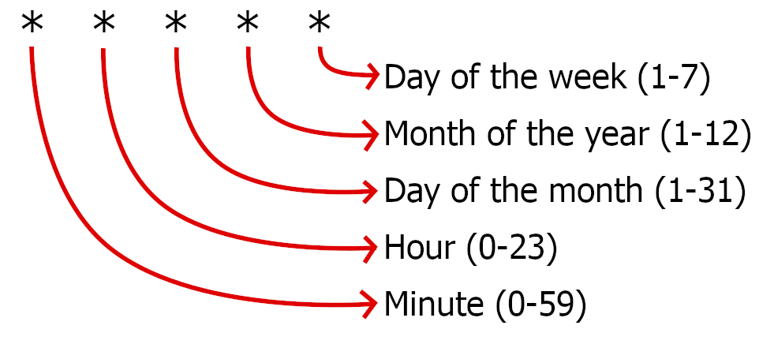

# schedule-jobs-with-cron

<a href="https://www.npmjs.com/package/schedule-jobs-with-cron"></href>

Schedule jobs in NodeJs using cron specifications

## Why?

- Support **async** worker function and compatible with **non-async** too
- Works with **standard crontab** definitions
- Cron parser shows the schedule in **plain english**
- **Typescript** support
- **Zero dependencies**
- **Small** (Less than 45 KB when installed from NPM)
- **Configurable**
- Other good cron packages haven't been updated in a while

## How to use basics:

To install it:

```shell
npm i schedule-jobs-with-cron
```

To use it:

```typescript
import { CronJob } from 'schedule-jobs-with-cron';

// Define and schedule a new job
const job1 = new CronJob(
  'A test Job 1',
  (triggerTime, log) => {
    log('info', `Hello from inside the job, it was triggered at: ${triggerTime}`);
  },
  '*/2 * * * *',
);

// Await for the job
await job1.getPromise();
```

### Explanation:

The above creates a new scheduled job, passing in a name (it can be named anything),
next is the worker function that will be triggered, and a standard cron schedule specification to use,
in this case it's `*/2 * * * *` which will run every 2 minutes.  
(The website https://crontab.guru is helpful to define cron schedules.)

Optionally the parsed cron specification can be printed out in english like this:

```typescript
job1.englishDescriptionOfCronSchedule;
```

As long as the job promise is awaited the job will continue to run and be rescheduled forever,
unless an endDate is provided through the optional parameters (more on that below).

The console output of the above will look like the following example:

```text
Job [A test Job 1]: Scheduled to execute: At every 2nd minute
Job [A test Job 1]: Scheduling to trigger in the next 81699 ms, at (Sat Jan 07 2023 04:24:00 GMT-0500 (Eastern Standard Time)) the time is now Sat Jan 07 2023 04:22:38 GMT-0500 (Eastern Standard Time).
Job [A test Job 1]: Hello from inside the job, it was triggered at: Sat Jan 07 2023 04:24:00 GMT-0500 (Eastern Standard Time)
Job [A test Job 1]: Scheduled trigger finished!
Job [A test Job 1]: Scheduling to trigger in the next 119997 ms, at (Sat Jan 07 2023 04:26:00 GMT-0500 (Eastern Standard Time)) the time is now Sat Jan 07 2023 04:24:00 GMT-0500 (Eastern Standard Time).
```

## Documentation:

The cron job is initialized by creating a new instance of the class `CronJob`. There is no limit to
the number of jobs that can be created. The constructor of `CronJob` takes the following parameters:

```typescript
const exampleJob = new CronJob(param1, param2, param3, param4);
```

### param1:

- String naming the job so that it is easier to distinguish in logs.

### param2:

- **Callback** worker function that can be either an async function or a simple plain function

- Optionally the function can make use of the **triggerTime** and the internal **logger** if desired to log things out in a consistent manner by passing a function with the following signature:

  `(triggerTime, log) => Promise<void> | void`

### param3:

- **String** representation of a standard cron spec. It may be helpful to use the online tool https://crontab.guru/ in assisting to compose a cron spec. The format of a standard cron spec is five parts separated by spaces

  example `* * * * *`

  

- **Here are some examples:**

  - `5 4 * * *` = At 04:05 every day

  - `15 */4 2 4 2` = At minute 15 past every 4th hour on day-of-month 2 and on Tuesday in April

  - `0 22 * * 1-5` = At 22:00 and on every day-of-week from Monday through Friday

  - `23 0-20/2 * * *` = At minute 23 past every 2nd hour from 0 through 20

  - `0 0,12 1 */2 *` = At minute 0 past hour 0 and 12 on day-of-month 1 in every 2nd month

  - `0 4 8-14 * *` = At 04:00 on every day-of-month from 8 through 14

  - `0 0 1,15 * 3` = At 00:00 on day-of-month 1 and 15 and on Wednesday

- **Note** that you can use the job property `.englishDescriptionOfCronSchedule` anytime to print out an english interpreted text of the cron spec that was used to initialize the job.

### param4:

- Optional additional **configuration** as a JSON object:

  ```typescript
  {
    /**
     * Optional specify wether to continue the job schedule if an
     * error occurs.
     * The default for this is false.
     */
    continueOnError: boolean

    /**
     * Optional date/time to specify when the job should stop executing.
     * When the job ends, the Promise returned by job.getPromise()
     * will be resolved.
     * The default for this is no end-date so it will run forever
     */
    endDate: Date

    /**
     * Optional date/time to specify when the job should begin executing
     * according to the schedule.
     * The default for this is current date time so the schedule
     * will being immediately.
     */
    startDate: Date

    /**
     * Disable logging that is generated by the job scheduler
     * or when using the log function passed into the jobWorkerFunction.
     * The default is false to enable logging.
     */
    disableLogging: boolean

    /**
     * Optional callback called after internally setting up timeout for
     * the next iteration of when the job is expected to trigger again.
     * This is typically useful for creating mocked
     * unit tests and not normally needed for normal operation,
     * but can be used for complex use cases if needed
     */
    afterSettingTimeoutCallback: (() => void)

    /**
     * Optional callback called just before triggering the
     * jobWorkerFunction. This is typically useful for creating mocked
     * unit tests and not normally needed for normal operation, but can be
     * used for complex use cases if needed.
     */
    beforeExecutingWorkerCallback: (() => void)
  }
  ```
